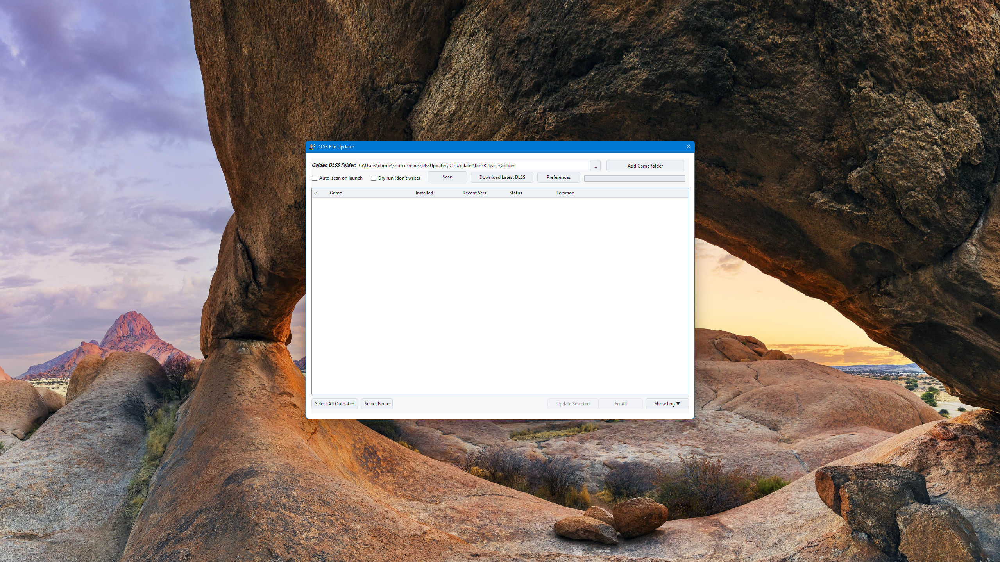
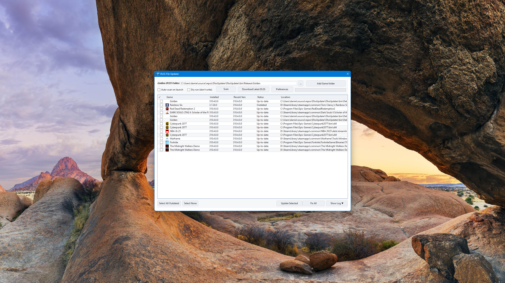
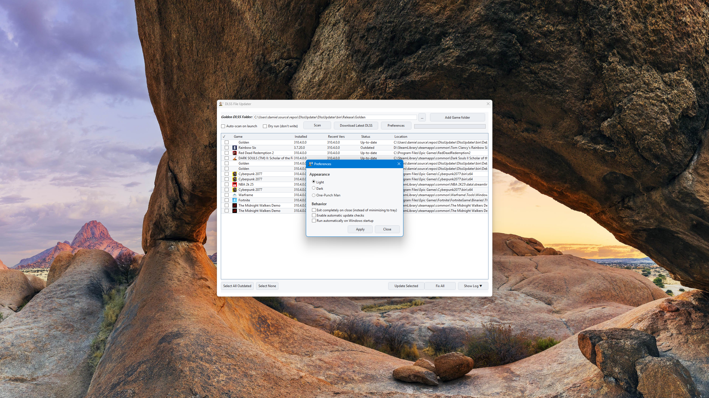

# DLSS-UPD

**DLSS-UPD** is a lightweight Windows app that helps you manage and update NVIDIA DLSS files quickly and safely.  
It provides an easy, friendly UI for checking, updating, and rolling back DLSS versions—no more digging through game folders.

<p align="center">
  <a href="https://github.com/YeokiNoewChi/DLSS-UPD/releases/tag/v0.0.1"></a>
  <a href="#requirements"></a>
  <a href="#requirements"></a>
</p>

---

## ✨ Features

- Detects installed DLSS versions  
- Updates to the latest available builds  
- Drag-and-drop game folder selection  
- Auto-scan on launch (optional)  
- Dry-run (no write) mode  
- Preferences for themes & behavior  
- Clear progress and status during updates  
- Local verification + auto-saved logs for transparency

---

## 📦 Installation

DLSS-UPD ships with an **Inno Setup** installer.

1. Download the latest **DLSS-UPD Installer (.exe)** from the [Releases](https://github.com/YeokiNoewChi/DLSS-UPD/releases/tag/v0.0.1) page.  
2. Run the installer and follow the prompts.  
3. Choose your install directory (default: `C:\Program Files\DLSS-UPD`).  
4. Launch from the desktop shortcut or Start Menu.

> #### 🔒 SmartScreen Notice
> Because DLSS-UPD is a small open-source app, **Windows SmartScreen** may show:
>
> *“Windows protected your PC.”*
>
> To continue:
> 1) Click **More info**  
> 2) **Run anyway**.

  
> DLSS-UPD is open-source and only accesses your local game files + checks DLSS updates online.

---

## 🚀 How to Use

1. Open **DLSS-UPD**  
2. Click **Download Latest DLSS**  
   - This creates a `DLSS-Releases` folder next to where **DLSS-UPD** is installed and downloads the newest releases there.  
3. Click **Scan** to detect your current DLSS versions & folder locations  
   - (Optional) Select a game folder or **drag & drop** it onto the window  
4. Select the games you want to **Update** (or use **Select All Outdated**)  
5. Click **Update Selected** or **Fix All** to replace old DLSS with the latest build

All updates are verified locally, and logs are saved automatically.

---

## ⚙ Preferences

Open **Preferences** from the toolbar to customize DLSS-UPD.

**Appearance**
- **Light**
- **Dark**
- **One-Punch Man** (fun themed palette)

**Behavior**
- **Exit completely on close** (instead of minimizing to tray)  
- **Enable automatic update checks** (for DLSS-UPD itself)  
- **Run automatically on Windows startup**

**Safety**
- **Dry run (don’t write)** — preview actions without changing files.

> Click **Apply** to save changes or **Close** to discard.

---

## 🪟 Screenshots

**Empty Scan / Startup View:**  


**Full Scan View:**  


**Preferences:**  


---

## 🔧 Requirements

- Windows 10 or newer  
- .NET 6.0 or later  
- Internet connection (for version checks & downloads)

---

## 🧹 Uninstallation

- **Settings → Apps** or **Control Panel → Programs & Features** → **DLSS-UPD** → **Uninstall**  
- Or run `unins000.exe` in the install directory (default `C:\Program Files\DLSS-UPD`)

All program files and shortcuts will be safely removed.

---

## 🧠 Technical Overview

DLSS-UPD is written in **C#** with **WPF (XAML)**—designed for simplicity, reliability, and maintainability.

- Organized XAML with custom control templates  
- Clean data binding with lightweight converters  
- Minimal code-behind for performance & clarity  
- Config + known folders persisted for faster future scans  
- Logs stored locally for transparency and support

### Build from source

```bash
git clone https://github.com/<your-repo>/DLSS-UPD.git
cd DLSS-UPD
dotnet build
